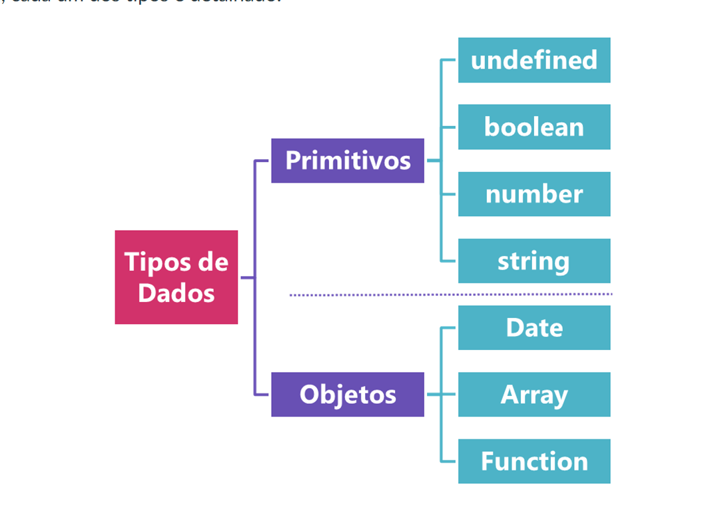
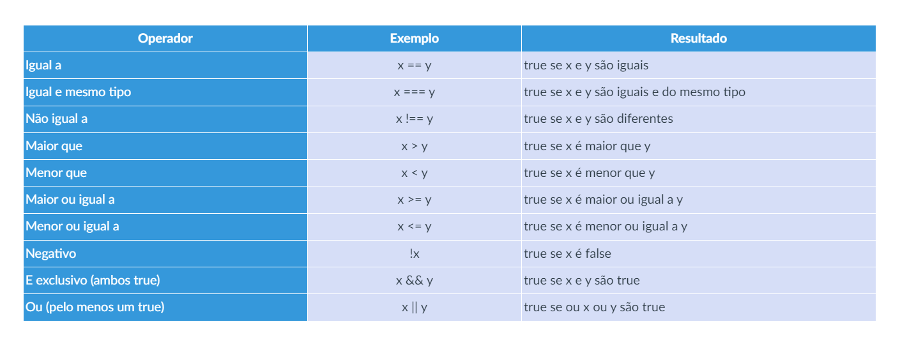
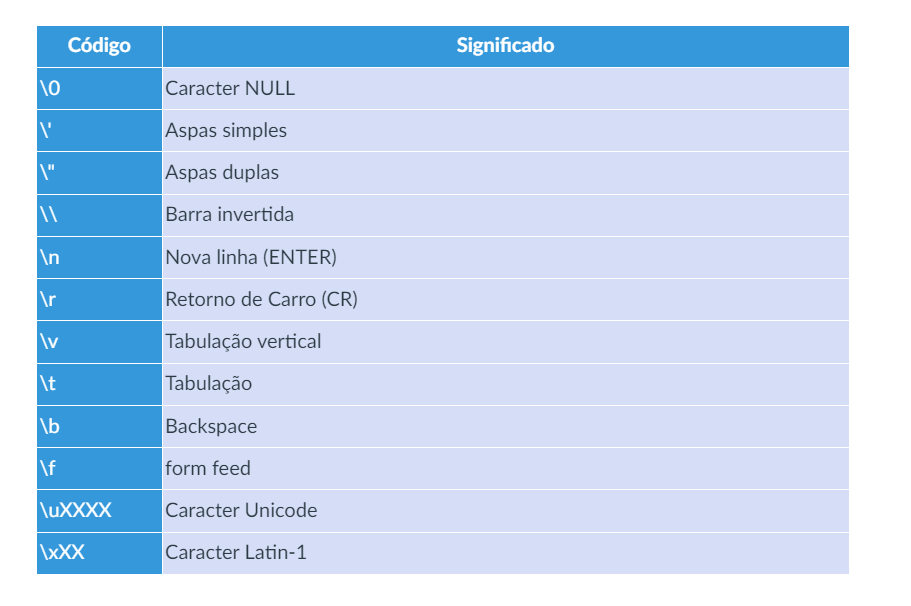
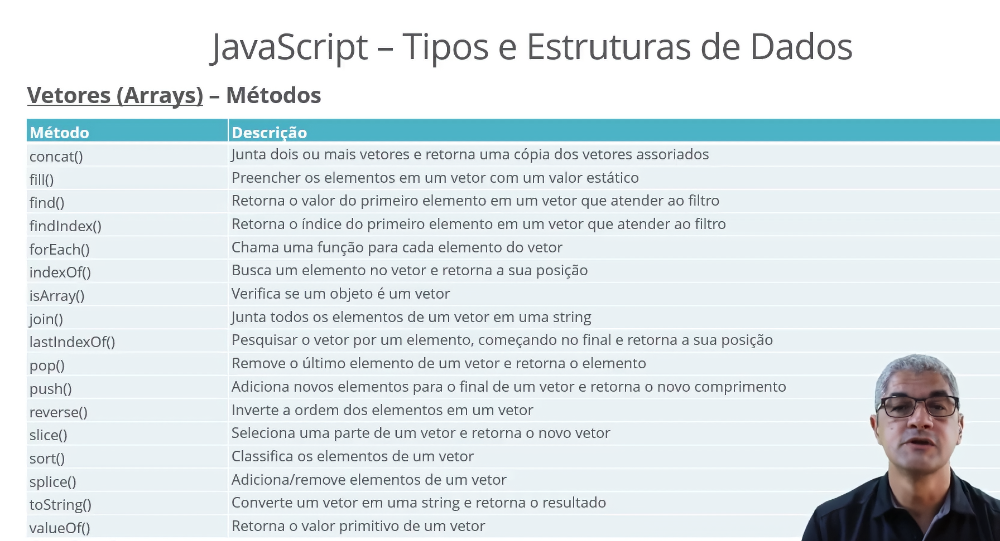
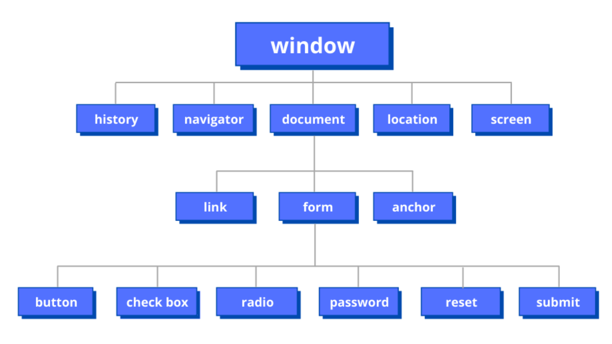
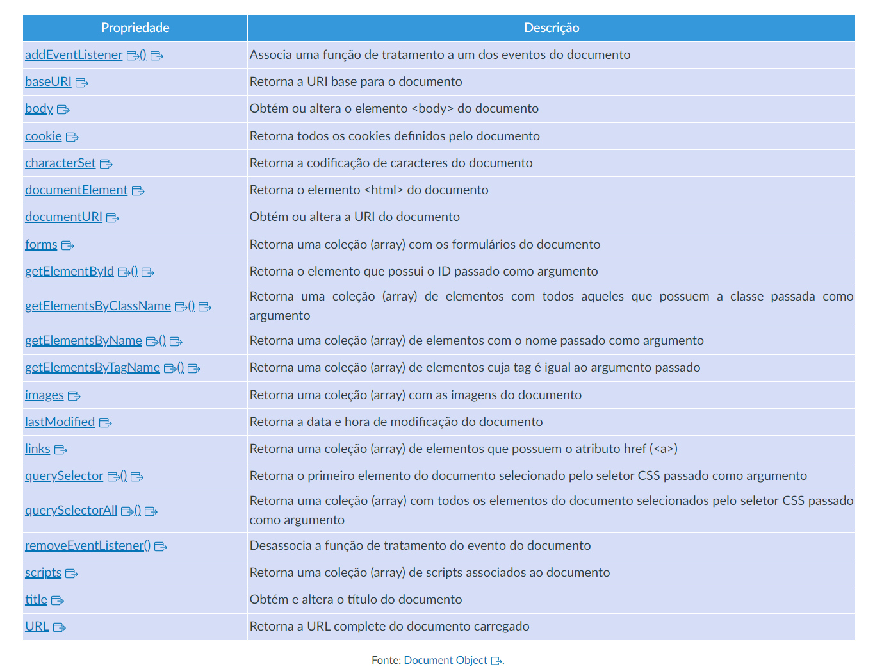
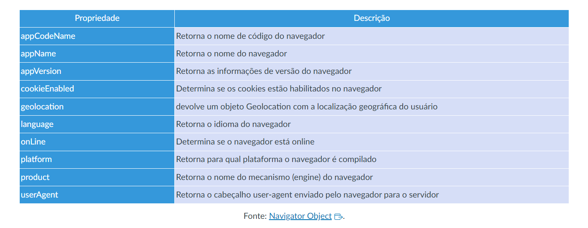
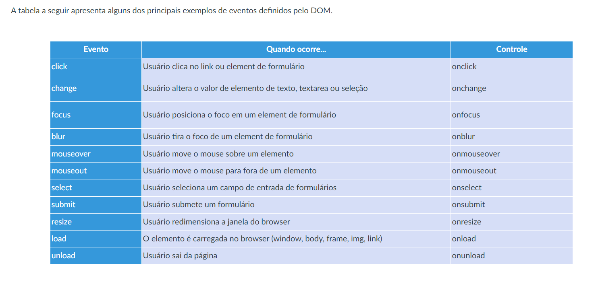
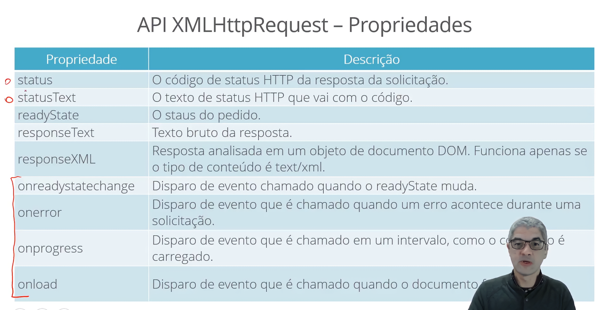
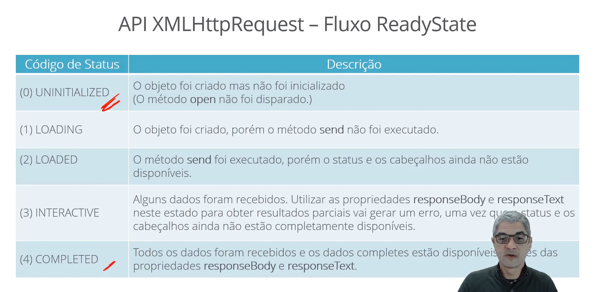

## hosting 

**hosting (elevação)** comportamento no javascript que trata as declarações de variáveis e funcões primeiramente, mesmo que a linha com a declaração esteja no meio do código ou no final


 ```js
console.log(a);       // Imprime undefined no console
var a = 10;
console.log(a);      // Imprime 10 no console


// O código acima é processado da seguinte maneira

var a;              // A declaração logo abaixo é processada antes
console.log(a);     // Imprime undefined no console
var a = 10;
console.log(a);     // Imprime 10 no console´
```


## JavaScript - Questões básicas

### Gramática

- JavaScript é **case sensitive** e ultiliza conjuntos de caracteres Unicode
  <sup>**nome** é diferente de **Nome** que é diferente de **NOME**</sup>

### Tipos e estrutura de dados



### TIPO BOOLEAN



### TIPO STRINGS



```js
<script>
var a = "Exemplo\nolá \'Mundo\'";
console.log (a);
</script>

saída

Exemplo
olá 'Mundo'


// Criação básica de uma string
let s1 = 'Em JavaScript '\n' significa é uma nova linha.'

// Strings de várias linhas
let s2 = 'Nas strings normais, não é possível
descrever texto em várias linhas'  

// Interpolação de expressões dentro de strings
var nome = "Rommel", tempo = "hoje";
let s3 = 'Olá ${nome}, como está você ${tempo}?'  

console.log('${s1} \n${s2} \n${s3}');
```
### VETORIES (ARRAYS)




## DECLARAÇÕES DE SELEÇÃO/ ESTRUTURA CONDICIONAL

```js
//se
if (expressão) { 
   comandos 
}
```


```js
//se
if (expressão) { 
   comandos_true 
} 
// se não
else { 
   comandos_false 
}
```


```js
// interruptor
switch (expressão) { 
  case valor_1:
    comandos_1
    [break;]
 
  case valor_2:
    comandos_2
    [break;]
 
  default: 
    comandos_default
}
```

```js
if (nota > 60) {
alert ('O aluno foi aprovado.');
}
else {
alert ('O aluno foi reprovado.');
}
```

```js
switch (fruta) {
      case 'abacaxi':
            alert ('Abacaxi');
            break;

      case 'banana':
            alert ('Banana');
             break;

default:
            alert ('Outras frutas');
            break;
}
```
## DECLARAÇÕES DE REPETIÇÃO/LAÇOS DE REPETIÇÃO/ESTRUTURA DE REPETIÇÃO

A primeira estrutura que vamos avaliar é feita com a palavra-chave **while**. Veja a sintaxe no exemplo a seguir. É importante que nos comandos haja a alteração dos termos envolvidos na expressão avaliada para evitar que o programa entre em loop infinito e não consiga parar de repetir os comandos.

```js
//enquanto
while (expressão) { 
   comandos
} 
```
No exemplo a seguir, utilizamos o comando **while** para fazer uma contagem regressiva. Observe que o comando que atualiza o valor do contador i e deve ser colocado dentro da estrutura para certificar que a repetição será finalizada.

```js
alert ('Iniciando a contagem regressiva.');

// Declare uma variável para servir de contador
var i = 3;

// Inicie a contagem regressiva avaliando o contador
while (i > 0) {
      alert ('Contagem: ' + i );

      // Diminui o contador em 1
      i--;
}
```
A próxima opção para repetição utiliza a palavra-chave **for**. A sintaxe é apresentada no exemplo de código a seguir e devemos observar as três partes que compõe a definição da repetição:

- **Inicialização:** parte que inicializa termos geralmente utilizados no controle da repetição como um índice das iterações;
- **Expressão:** condição que valida a cada iteração se o programa deve continuar repetindo os comandos;
- **Finalização:** parte que é executada ao final de cada iteração e geralmente atualiza os termos utilizados na expressão que valida a continuidade da repetição.

```js
// para
for (expressão) { 
   comandos
} 
```
No exemplo de código a seguir, o programa imprime no console o nome das frutas mantidas no **array** criado na primeira linha. Perceba que na primeira parte inicializamos uma variável index que é utilizada para ser testada contra o número de itens do **array** (aFrutas.length), na segunda parte é feito o teste e na terceira parte, esse índice é atualizado.

```js
let aFrutas = ['abacaxi', 'banana', 'laranja'];
for (let index = 0; index < aFrutas.length; index++) {
      const element = aFrutas[index];
      console.log (element);
}
```

## FUNÇÕES

As funções são porções de código que podem ser disparadas em uma parte do programa, sendo que o código executado pode ou não retornar um valor. Um dos objetivos das funções é organizar o código do programa. Outro objetivo é permitir que um código que se repete diversas vezes no programa como exibir uma mensagem ao usuário possa ser isolado para ser reutilizado sempre que necessário, bastando para isso alterar o conteúdo da mensagem a ser exibida. No JavaScript, as funções também são tratadas como objetos.

No exemplo de código, a seguir, definimos uma função, com a palavra-chave function, que calcula a soma de dois valores e retorna esse resultado para o ponto de onde a função foi disparada. Logo após a palavra-chave function, é colocado o nome da função que, caso do exemplo, é soma. Esse nome será utilizado para disparar a referida função. Na sequência, dentro de parênteses, são colocados os argumentos que serão encaminhados para a função e utilizados no processamento. Os argumentos tornam o código genérico e permite que a função seja utilizada diversas vezes em contextos distintos. Para que a função retorne um valor, é utilizada a palavra-chave return. Assim que o comando de retorno é executado o programa encerra o código da função e retorna para o ponto de disparo.

```js
function soma (x, y) {
    var total = x + y;
    return total;
}

a = soma(2,3)             // retorna 5 e atribui o valor à variável a
b = soma()                // retorna NaN e atribui o valor à variável b
```
## DOCUMENT OBJECT MODEL (DOM)



A relação a seguir apresenta o significado de cada um dos principais elementos disponíveis por meio do DOM:

- **window** – representa a janela do navegador
- **navigator** – contém informações sobre o - navegador
- **screen** – contém informações sobre a tela do cliente
- **history** – contém os sites visitados
- **location** – contém informações sobre a URL atual
- **document** – representa um documento HTML e pode ser usado para acessar todos os outros elementos
- **Outros** – cada elemento da linguagem HTML possui um objeto associado que pode ser utilizado para montar a dinâmica das páginas Web, são eles: anchor, area, base, body, button, event, form, frame, frameset, iframe, image, input button, input checkbox, input file, input hidden, input password, input radio, input reset, input submit, input text, link, meta, object, option, select, style, table, tablecell, tablerow, textarea.
 

### Object Window

O objeto window é o responsável por toda a hierarquia de objetos associados à janela aberta no Navegador. Como visto na hierarquia de objetos do DOM, os demais objetos associados ao documento e ao Navegador são acessíveis a partir do elemento **window**.

Para gerenciar o armazenamento de dados no Navegador, o objeto window fornece dois repositórios: o **localStorage** e o sessionStorage. O repositório **localStorage** permite que os dados sejam mantidos, mesmo que o Navegador seja fechado. O sessionStorage mantém os dados apenas durante a sessão do usuário, sendo perdidos assim que o Navegador é fechado. Em ambos os repositórios, os dados são armazenados no formato de nome e valor, em que o nome é utilizado como chave para guardar e recuperar o valor que foi guardado. O exemplo de código a seguir mostra como utilizar esses repositórios. Para guardar um valor é utilizado o método setItem (nome, valor) e, para recuperar o valor guardado, é utilizado o método getItem (nome).

```js
sessionStorage.setItem ('login', 'rommelcarneiro');
alert ('O usuário logado é: '+ sessionStorage.getItem ('login'));
```
Para programar algumas ações de acordo com o tempo, objeto **window** fornece alguns métodos muito úteis ao desenvolvedor Web:

- **setInterval (função, intervalo)** – informa o Navegador para executar uma função continuamente a cada intervalo, medido em milissegundos;
  
- **clearInterval ()** – cancela a repetição da função;
  
- **setTimeout (função, intervalo)** – agenda uma função no Navegador para ser executada depois de um intervalo em milissegundos.
  
- **clearTimeout ()** – cancela o agendamento.

### Object Document

Assim que uma página é carregada no Navegador, os elementos HTML e sua hierarquia se transformam no objeto **document** do DOM.

Na tabela a seguir, são relacionadas as principais propriedades do elemento **document**.



Entre os diversos recursos do objeto **document**, destacam-se os métodos utilizados para obter os elementos de uma página. Isso nos dará acesso para manipulação do conteúdo e das características do que é apresentado ao usuário. No exemplo de código a seguir, o método **getElementById** é utilizado para alterar o conteúdo de um elemento `<div>` informando a data corrente.

```js
<!DOCTYPE html>
<html>

<head>
         <title>Laboratório Javascript</title>
         <script type="text/javascript">
                function Executar() {
                       document.getElementById('saida').innerHTML = Date();
                 }
        </script>
</head>

<body>
       <button type="button" onclick="Executar ();">Disparar</button>
       <hi>Saída</h1>
       <div id="saida"></div>
</body>

</html>
```
### Object Navigator

O software utilizado como **Navegador** é representado pelo objeto navigator e é possível obter informações sobre este software e os recursos suportados por meio desse objeto.



O exemplo de código a seguir apresenta a forma de se obter a posição geográfica do computador do usuário a partir do objeto **geolocation** do **navigator**.

```js
<!DOCTYPE html>
<html>
<head>
   <title>Laboratório Javascript</title>
   <script type="text/javascript">
     function getPosition() {
      if (navigator.geolocation) {
          navigator.geolocation.getCurrentPosition(showPosition);
     } else {
        x.innerHTML = "A funcionalidade de Geolocation não é " +
        "suportada neste browser.";
     }
    }

    function showPosition(position) {
      lat = position.coords.latitude;
      long = position.coords.longitude;
      texto = "Minha posição é dada pela latitude" + lat
              + " e longitude " + long;
      document.getElementById('saida' ). innerHTML = texto;
    }
</script>
</head>
<body>
   <button type="button" onClick="getPosition ();">
       Posição geográfica</button>
   <hi>Saída</h1>
   <div id="saida"></div>
</body>
</html>
```
### Eventos



### AJAX



